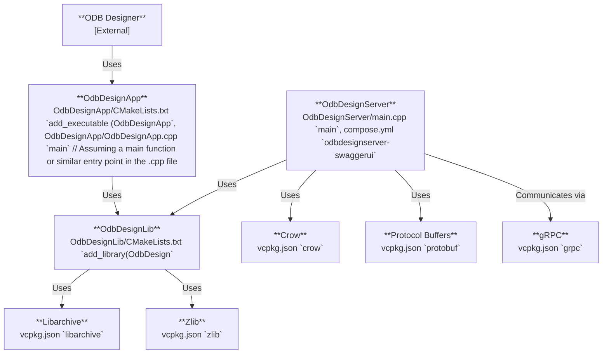

# OdbDesign CodeViz Diagram

```mermaid
graph TD

    base.cv::odbDesignServer["**OdbDesignServer**<br>OdbDesignServer/main.cpp `main`, compose.yml `odbdesignserver-swaggerui`"]
    base.cv::odbDesignApp["**OdbDesignApp**<br>OdbDesignApp/CMakeLists.txt `add_executable (OdbDesignApp`, OdbDesignApp/OdbDesignApp.cpp `main` // Assuming a main function or similar entry point in the .cpp file"]
    base.cv::odbDesignLib["**OdbDesignLib**<br>OdbDesignLib/CMakeLists.txt `add_library(OdbDesign`"]
    base.cv::libarchive["**Libarchive**<br>vcpkg.json `libarchive`"]
    base.cv::zlib["**Zlib**<br>vcpkg.json `zlib`"]
    base.cv::crow["**Crow**<br>vcpkg.json `crow`"]
    base.cv::protobuf["**Protocol Buffers**<br>vcpkg.json `protobuf`"]
    base.cv::grpc["**gRPC**<br>vcpkg.json `grpc`"]
    base.cv::odbDesigner["**ODB Designer**<br>[External]"]
    %% Edges at this level (grouped by source)
    base.cv::odbDesigner["**ODB Designer**<br>[External]"] -->|"Uses"| base.cv::odbDesignApp["**OdbDesignApp**<br>OdbDesignApp/CMakeLists.txt `add_executable (OdbDesignApp`, OdbDesignApp/OdbDesignApp.cpp `main` // Assuming a main function or similar entry point in the .cpp file"]
    base.cv::odbDesignApp["**OdbDesignApp**<br>OdbDesignApp/CMakeLists.txt `add_executable (OdbDesignApp`, OdbDesignApp/OdbDesignApp.cpp `main` // Assuming a main function or similar entry point in the .cpp file"] -->|"Uses"| base.cv::odbDesignLib["**OdbDesignLib**<br>OdbDesignLib/CMakeLists.txt `add_library(OdbDesign`"]
    base.cv::odbDesignServer["**OdbDesignServer**<br>OdbDesignServer/main.cpp `main`, compose.yml `odbdesignserver-swaggerui`"] -->|"Uses"| base.cv::odbDesignLib["**OdbDesignLib**<br>OdbDesignLib/CMakeLists.txt `add_library(OdbDesign`"]
    base.cv::odbDesignServer["**OdbDesignServer**<br>OdbDesignServer/main.cpp `main`, compose.yml `odbdesignserver-swaggerui`"] -->|"Uses"| base.cv::crow["**Crow**<br>vcpkg.json `crow`"]
    base.cv::odbDesignServer["**OdbDesignServer**<br>OdbDesignServer/main.cpp `main`, compose.yml `odbdesignserver-swaggerui`"] -->|"Uses"| base.cv::protobuf["**Protocol Buffers**<br>vcpkg.json `protobuf`"]
    base.cv::odbDesignServer["**OdbDesignServer**<br>OdbDesignServer/main.cpp `main`, compose.yml `odbdesignserver-swaggerui`"] -->|"Communicates via"| base.cv::grpc["**gRPC**<br>vcpkg.json `grpc`"]
    base.cv::odbDesignLib["**OdbDesignLib**<br>OdbDesignLib/CMakeLists.txt `add_library(OdbDesign`"] -->|"Uses"| base.cv::libarchive["**Libarchive**<br>vcpkg.json `libarchive`"]
    base.cv::odbDesignLib["**OdbDesignLib**<br>OdbDesignLib/CMakeLists.txt `add_library(OdbDesign`"] -->|"Uses"| base.cv::zlib["**Zlib**<br>vcpkg.json `zlib`"]

```
---
*Generated by [CodeViz.ai](https://codeviz.ai) on 12/12/2025, 3:05:37 AM*
